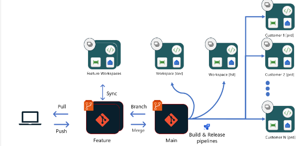

## Descripcion

En este repositorio vamos a utilizar la misma estructura que vamos a utilizar en nuestro el repositorio oficial, ya sabemos guardar archivos de power bi como proyectos (pbip) ahora vamos a utilizar las ramas.

Cada carpeta esta conectada un WorkSpace de Microsoft fabric.

Las siguientes cuentas van a tener acceso al repositorio

_para utilizar este repositorio no es necesario hacer el FORK_

- Nicolas j. Suarez
- Sandra Milena
- Juan del mar
- Daniel Piamba
- Camila Preciado
- Jesús Pardo
- Cristian Cardenas
- Lenin Camilo Beltran
- Laura M. Alvarez

Todos los cambios que se quieran hacer deben crearse en la rama: Feature/"accion-elemento", en el campo accion se debe colocar lo que se quiere hacer (implementación, creación, modificación, etc.), el elemento es el archivo pbi que queremos cambiar,

_TODOS LOS CAMBIOS HECHOS SOBRE LA RAMA MAIN NO SERAN ACEPTADOS_

# TAREA

Su tarea es crear su rama Feature/creacion-pbi-xxxxxx y que suban el reporte en la carpeta DESARROLLO una vez subido tienen que solicitar el PR (Pull Request) para que quede en la rama fuente
