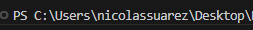

# Semana #4 Utilizando GIT

En esta semana tendremos 2 actividades!

# Actividad 1

## Pasar el tablero que subiste al ambiente de pruebas

a.1 Para hacer esto tienes que seguir trabajando en tu rama creada(Feature/xxxxx )
a.2 Compiar los 3 elementos del archivo que son: - pbi-xxx.semanticmodel - pbi-xxx.Report - pbi-xxxx.pbip
a.3 Pegar en la carpeta TEST
a.4 hacer los comandos `git pull origin main` para descargar los cambios ya hechos y que tu rama este al dia
a.5 Hacer el proceso de commit:

```
Git add .
Git commit -m "Titulo del commit" -m "Descripcioooooooooooon del commit"
Git push
```

# Actividad 2 Repositorio Azure

b. Aqui vas a clonar el un repositorio que ya tiene conectado Work Spaces de Fabric para poder ver los tableros para esto vas a tener que hacer 2 cosas

## b.1. Crear la clave ssh

    b.1.1 Una clave SSH (Secure Shell) es una credencial de acceso que permite la autenticación segura en sistemas y servidores remotos a través del protocolo SSH, utilizado principalmente para administrar servidores de forma remota.
    b.1.2 Para crear una tienes que ejecutar el siguiente codigo en la terminal:

```
ssh-keygen -t rsa-sha2-256
```

    Este codigo te genera una clave privada y una clave publica.

    b.1.2 Para poder tener acceso a este repositorio necesitas compartir tu clave publica debes ser cuidadoso con esta clave, esta clave se genera en la raiz donde ejecutes el comando,



    ahi tienes que buscar el archivo .pub y abrirlo con el editor de texto,

    b.1.3 Tienes que enviar esta clave al correo @NicoJSuarez2 nicolassuarez@periferia-it.com

    Los siguientes ya la enviaron:
    @Camipre
    @juan-del-mar
    @lalvarezo96  🥇
    @Lenin-Per
    @Lycrisiz
    @Milesara2012
